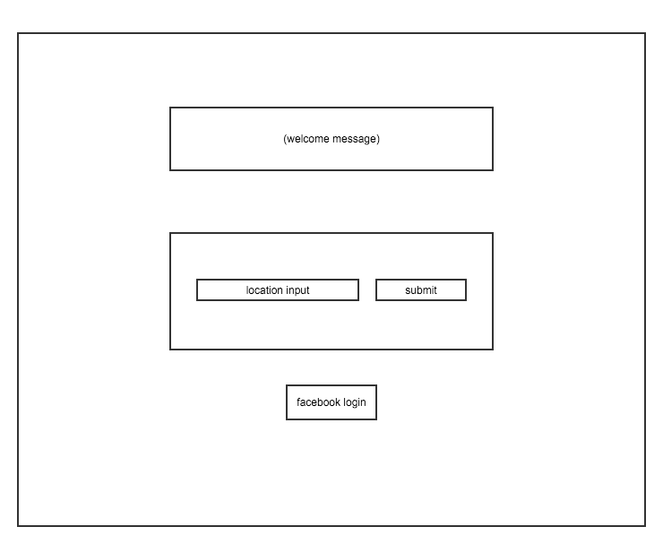
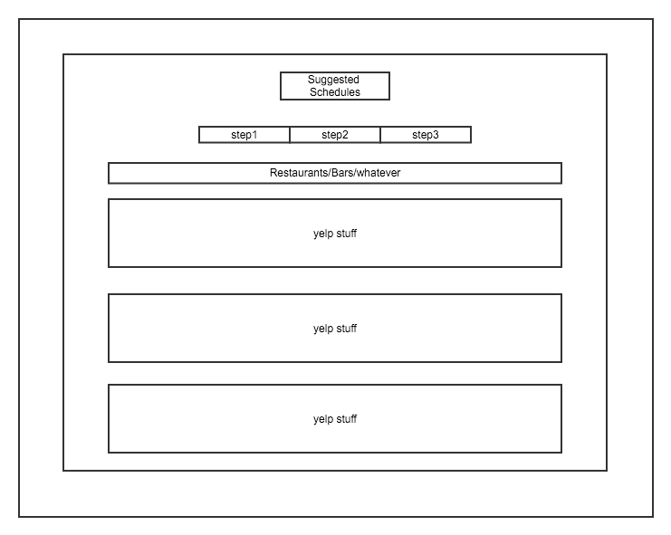
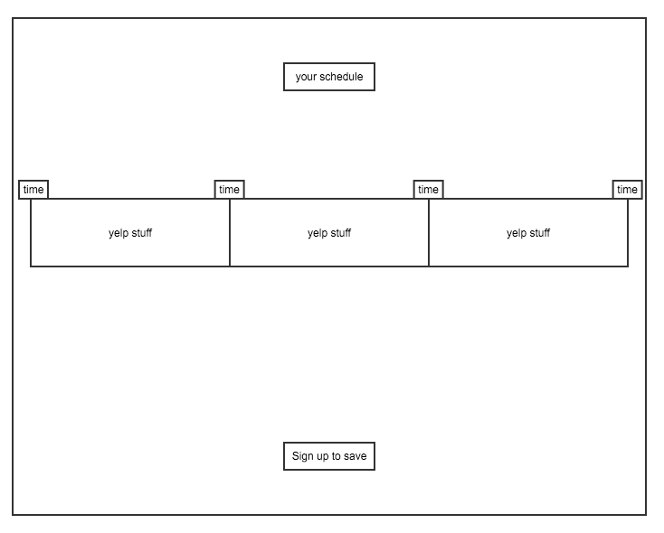
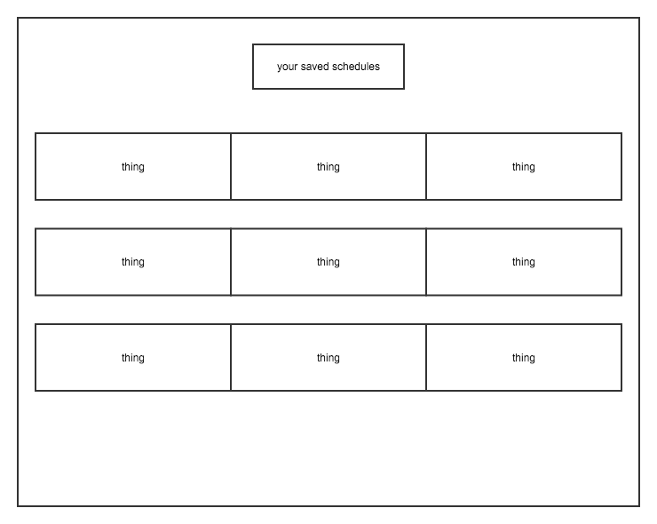

# Skedgit

### Description

### Technologies Used

- NodeJS + Express
- MongoDB + Mongoose
- Javascript + jQuery
- AJAX
- Passport
- Materialize
- HTML
- CSS

### Third-party APIs

- Yelp

### OAuth Providers

- Facebook

### Wireframes

  

 

 

 

 

### Data Model

